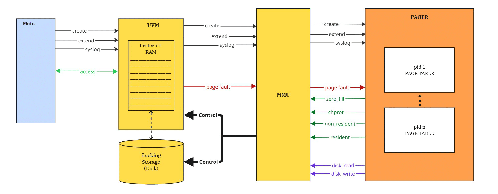
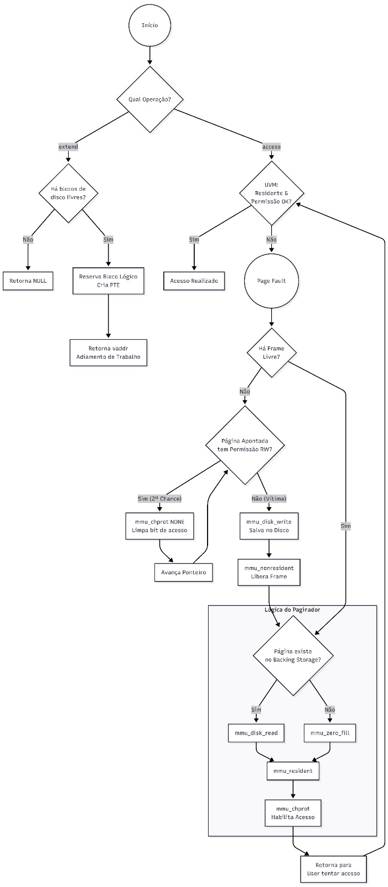

<!-- LTeX: language=pt-BR -->

# PAGINADOR DE MEMÓRIA -- RELATÓRIO

1. Termo de compromisso

    Ao entregar este documento preenchido, os membros do grupo afirmam que todo o código desenvolvido para este trabalho é de autoria própria. Exceto pelo material listado no item 3 deste relatório, os membros do grupo afirmam não ter copiado material da Internet nem ter obtido código de terceiros.

2. Membros do grupo e alocação de esforço

    Preencha as linhas abaixo com o nome e o email dos integrantes do grupo. Substitua marcadores `XX` pela contribuição de cada membro do grupo no desenvolvimento do trabalho (os valores devem somar 100%).

    * Ana Paula Pereira Theobald anatheobald@ufmg.br 33%
    * Caio Souza Grossi csgrossi@ufmg.br 33%
    * Pedro Bacelar Rigueira pedrobacelar@ufmg.br 33%

3. Referências bibliográficas

    * Nenhuma além do enunciado e do código base fornecido pelo professor.

4. Detalhes de implementação

    1. Estruturas de dados

        Vetor global de frames com ponteiro de relógio para a política Segunda Chance, vetor de blocos de disco livres, tabela de processos contendo as páginas de cada processo (bloco reservado, frame atual, proteção, flag de sujidade (dirty) e indicação se já existe cópia válida em disco). Cada processo pode ter até 256 páginas, limitadas pela faixa UVM.

    2. Controle de acesso

        Páginas novas são mapeadas após `zero_fill` (ou `disk_read`, caso exista cópia em disco) sempre como somente leitura. A primeira escrita em uma página provoca uma falta de página e uma chamada a `mmu_chprot` para `PROT_READ | PROT_WRITE`, marcando a página como `dirty`. O algoritmo Segunda Chance remove as permissões com `mmu_chprot(PROT_NONE)` e zera o bit `referenced`; o primeiro acesso após isso gera uma nova falta, permitindo ao paginador restaurar a proteção e marcar a página como referenciada novamente. A escolha da vítima é determinística: prefere-se o menor frame livre; caso contrário, realiza-se uma varredura circular até encontrar um frame com `referenced == 0`. A página suja é escrita em disco com `mmu_disk_write` e o mapeamento é liberado com `mmu_nonresident` antes de reutilizar o frame.

5. Extra: documentação do código

    1. Arquitetura do sistema de memória virtual

        

        O diagrama ilustra a interação entre o processo do usuário (azul), a infraestrutura de hardware simulada (amarelo) e o paginador (laranja). Destacam-se o ciclo de tratamento de falhas de página (page faults) e o mecanismo de controle da memória física e do armazenamento secundário via MMU.

    2. Fluxograma do funcionamento de um gerenciador de memória virtual

        